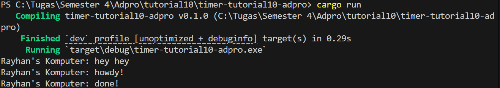

"# timer-tutorial10-adpro

## Experiment 1.2: Understanding how it works

Pada eksperimen ini, program berhasil dijalankan dengan output yang sesuai. Output \"hey hey\" muncul lebih dahulu karena perintah `println!(\"Rayhan's Komputer: hey hey\")` langsung dieksekusi oleh thread utama sebelum executor mulai bekerja. Sementara itu, task yang didaftarkan melalui `spawner.spawn(...)` hanya dimasukkan ke dalam queue dan baru diproses ketika `executor.run()` dipanggil. Di dalam task tersebut, output \"howdy!\" dicetak, diikuti oleh jeda dua detik dari `TimerFuture`, dan akhirnya output \"done!\" muncul. Gambar di bawah ini memberikan ilustrasi bagaimana executor dan spawner bekerja untuk menangani future yang dijalankan.

"
